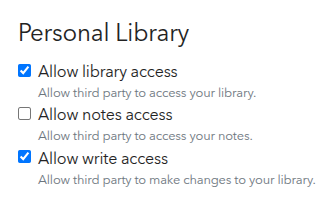
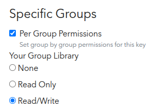
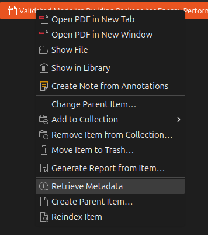
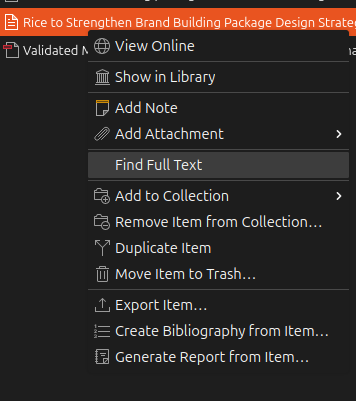
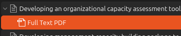
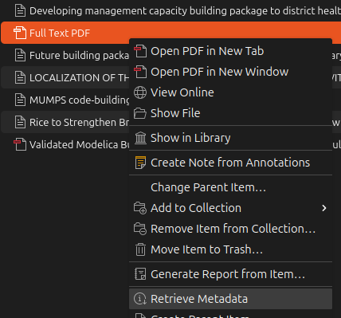

# Zotero

Select SnowSearch commands support creating and uploading Zotero entries directly using
[pyzotero](https://github.com/urschrei/pyzotero) post-execution for immediate review.

## Generating a Zotero API Key

API Keys can be created at https://www.zotero.org/settings/keys/new. Best practice to create keys with
the minimal permissions required. If a key has excessive permissions, SnowSearch will print a warning with a
recommended  
action. Once the key has been generated, add the `ZOTERO_API_KEY` to your `.env` file like so:

```
ZOTERO_API_KEY=<your-key-here>
```

### Key for Personal Library



For uploading to a personal library, ensure the key has the "Allow library access" and "Allow write access" options
checked.

### Key for Group Library



For uploading to a group or shared library, under "Specific Groups" select "Per Group Permissions" - this will allow
you to configure permissions for a specific group library. Then find the group library you wish to upload to and select
"Read/Write".

Additionally, the group library **must** be private (cannot upload PDFs to public) and you have write access to the
library.

## Uploading to a Personal Library

To upload to a personal library, use the `-zu` argument where available with your Zotero User ID, which can be found at
https://www.zotero.org/settings/security > Applications. To upload to a specific collection or folder, use the `-zc`
argument to provide the collection ID. This can be found in the url when accessing your Zotero library via the web
client, NOT the desktop client, after selecting the desired collection like so:
https://www.zotero.org/<zotero-username>/collections/**<collection-id>**/collection.

## Uploading to a Group Library

To upload to a group library, use the `-zg` argument where available with the group library ID, which can be found in
the url when accessing your Zotero library via the web client, NOT the desktop client, after selecting the desired
group library like so: https://www.zotero.org/groups/**<group-id>**/<library-name>/library

## Limitations

As of development, the Zotero API does not support running the metadata retrieval. This means items and PDFs can only
be created and uploaded without being indexed using one of Zotero's catalogers. Additional metadata retrieval must be
triggered manually using the desktop client, NOT the web client.

### Retrieving PDF Metadata



If a PDF was uploaded, simply right-click the entry and select "Retrieve Metadata". This will automatically create
an item populated with the correct metadata details.

### Retrieving Item Metadata



SnowSearch will automatically attempt to download a paper PDF and upload directly to Zotero, however if a PDF is not
available (paper has not been indexed in OpenAlex or is closed-source), a placeholder Journal Article will be created.
Right-clicking the entry and selecting "Find Full Text" will attempt to use Zotero's resources to find the PDF.



If the PDF is available, it will be attached to the existing entry.



In order to retrieve metadata, remove it from the original placeholder entry, right-click the PDF, and select
"Retrieve Metadata". A new entry will be created as described in the previous section and the old placeholder entry can
safely be deleted.
