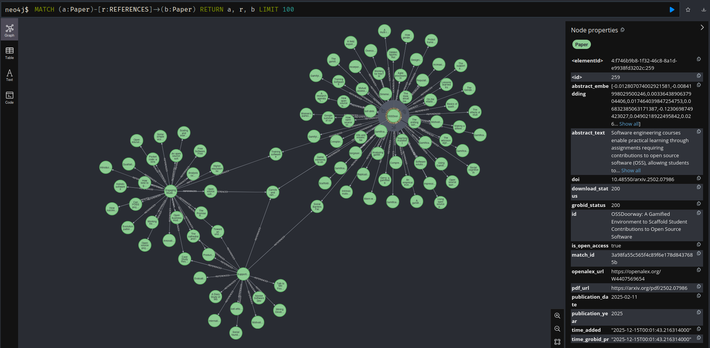

# SnowSearch

> An automated systematic literature review tool chain that finds rounds of related papers and ranks them by relevance
> using an LLM of your choice.

### ✨ Features

- 🔍 Automated paper search
- 🧠 LLM natural language → structured query generation
- 📊 LLM-based abstract ranking
- 🚀 GPU support

### Table of Contents

- [Quickstart](#quickstart)
- [Accessing the Database](#accessing-the-database)
- [Enabling GPU Access](#enabling-gpu-access)
- [Local Deployment and Development](#local-deployment-and-development)
- [Acknowledgments](#acknowledgments)
- [Questions or Issues?](#questions-or-issues)

## Quickstart

1. Build the image

```bash
docker build -t snowsearch .
```

2. Create a `.env` file
   Other `env` vars can be set, but for a minimal setup `NEO4J_AUTH` **must** be set

```
NEO4J_AUTH=neo4j/<your password here>
```

If using OpenAI, also add your API key under `OPENAI_API_KEY`

3. Launch the compose stack

```bash
docker compose up
```

Append the `-d` to launch in the background. Make sure to wait a few moments before launching the CLI to ensure all
services are running

> [!WARNING]  
> The [grobid](https://hub.docker.com/r/grobid/grobid) and [ollama](https://hub.docker.com/r/ollama/ollama) images
> are several gigabytes large, they will take a while to download on first time setup

4. Launch the CLI

```bash
docker run --rm -it -env-file=.env --network=snowsearch-net snowsearch slr "Your search here"
```

and snowsearch will do the rest! For the list of all options, see the [commands readme](docs/commands.md).

> [!NOTE]  
> The cli will download a model from ollama automatically (Default is `llama3:latest`), but you can download the model
> ahead of time by running `docker exec ollama pull <desired model>`. This only applies if using ollama.

## Accessing the Database



SnowSearch uses [Neo4j](https://github.com/neo4j), a graph based database, to store data about the papers collected.
Neo4j does have a GUI available to more directly view the data. To access, launch the compose stack with the following
command:

```bash
docker compose -f compose.yaml -f override/database.yaml up
```

This will open the database ports, which will now be available at [localhost:7474](http://localhost:7474/) if using the
default settings. The username and password will be the same ones set in your `.env` file.

## Enabling GPU Access

If your machine supports [cuda](https://en.wikipedia.org/wiki/CUDA), there are options available to allow access to
your GPUs to great increase Grobid and ollama performance. To enable, launch the compose stack with the following
command:

```bash
docker compose -f compose.yaml -f override/gpu.yaml up
```

> [!NOTE]  
> Overrides are not exclusive. The only requirement is that the first `-f` argument **MUST** be `compose.yaml, then 
> overrides can be used in any order. For example, to run with database access and GPU support, run 
> `docker run --rm -it -f compose.yaml -f override/database.yaml -f override/gpu.yaml up`

## Local Deployment and Development

1. Setup virtual Python environment

```bash
pip -m venv venv
```

Then activate

Windows:

```bash
. venv/Scripts/activate
```

Linux:

```bash
. venv/bin/activate
```

2. Install dependencies

```bash
pip install -r requirments.txt
```

3. Test script

```bash
python3 snowsearch -h
```

The help menu should show.

The compose services will also need to be running, which you can launch like so:

```bash
docker compose up -f compose.yaml -f override/dev.yaml
```

This will open up all service ports so scripts run on your machine will be able to access them through `localhost` and
their respective ports. For working with the database, see the [database doc](docs/database.md) for a rundown to how objects have been 
structured.

## Acknowledgments

This toolchain would not be possible without these amazing projects, be sure to check them out!

- [Grobid](https://github.com/kermitt2/grobid): A machine learning software for extracting information from scholarly
  documents
- [OpenAlex](https://openalex.org/): An free database of over 240 million scholarly works (articles, books, datasets,
  theses)
- [findpapers](https://github.com/jonatasgrosman/findpapers) (Honorable Mention): An application that helps researchers
  who are looking for references for their work. The application will perform searches in several databases. I did not
  use this tool in the end but served as inspiration for many aspects of snowsearch.

## Questions or Issues?

If you encounter a bug, have a question, or want to suggest a feature, feel free to open a GitHub issue!
For contributing, see [CONTRIBUTING.md](CONTRIBUTING.md).